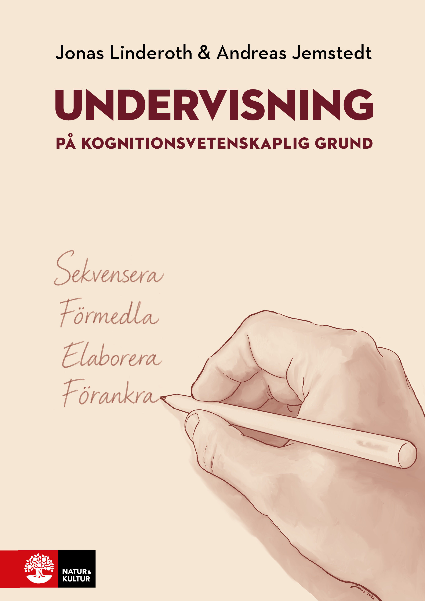

:::: {.container style="display: flex; flex-direction: row; flex-wrap: wrap; align-items: flex-start; gap: 20px; margin-bottom: 2em; text-align: left;"}
```{=html}
<div style="flex: 0 0 300px; max-width: 100%; margin: 0 auto; display: flex; flex-direction: column; align-items: center; gap: 2em;">

  

  <div style="width: 100%; border-top: 1px solid #ddd; padding-top: 1.25em; display: flex; flex-direction: column; align-items: center; gap: 0.8em; text-align: center;">

    <div style="font-size: 0.85em; font-weight: 700; letter-spacing: 0.14em; text-transform: uppercase; color: #6c1827;">New book</div>

    <a href="https://www.nok.se/titlar/laromedel-b2/undervisning-pa-kognitionsvetenskaplig-grund/" style="display: block; line-height: 0;">
      
    </a>

    <div>
      <div class="h5" style="margin: 0 0 0.25em 0;">Undervisning på kognitionsvetenskaplig grund</div>
      <div style="font-size: 0.9em; color: #555;">With Jonas Linderoth</div>
      <div style="font-size: 0.9em; color: #555;">Natur &amp; Kultur, 2026 · in Swedish</div>
    </div>

    <a href="https://www.nok.se/titlar/laromedel-b2/undervisning-pa-kognitionsvetenskaplig-grund/">About the book</a>

  </div>

</div>
```

::: {style="flex: 1 1 400px; min-width: 0;"}
## Research and Teaching

I’m a cognitive psychologist working as an Associate Professor (Docent) in the Department of Education at Stockholm University. My research focuses on how people learn, how they make decisions under uncertainty, and how these judgments shape their behavior. I have a strong interest in quantitative methods, particularly Bayesian modeling, as tools for understanding these cognitive processes.

Alongside research, I teach courses on how insights from cognitive science and the science of learning can be applied in educational settings. For example, how findings from research can be used to improve classroom practice, students self-regulated learning, and the design of digital learning aids.

I also work with data, both from my own research and in collaboration with others. I have occasionally worked with teams outside my main area on experimental design, statistical analysis, or modeling, particularly in projects involving behavioral or cognitive data.

## Other Work

Most of my work is academic, but I also contribute my expertise to projects beyond my own research and teaching. This has included presentations and workshops, course design, report writing, and quantitative data analysis.

I'm open to a range of projects, both within and beyond academia. If you're working on something where my expertise could be useful, or have data you'd like to explore, I'd be happy to hear from you.

📩 [Contact me](contact.qmd){.button}
:::
::::